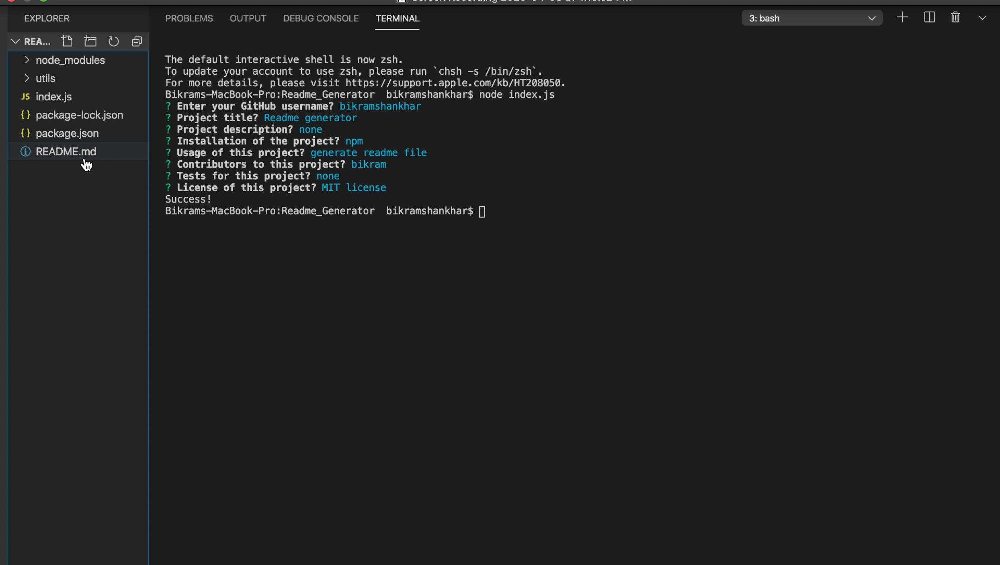

# Readme Generator

CLI that generates from user`s input. The users are prompted with some question and base on answers, It will generates readme.md file.




## Usage

```
npm install
```
## License
[MIT](https://choosealicense.com/licenses/mit/)
